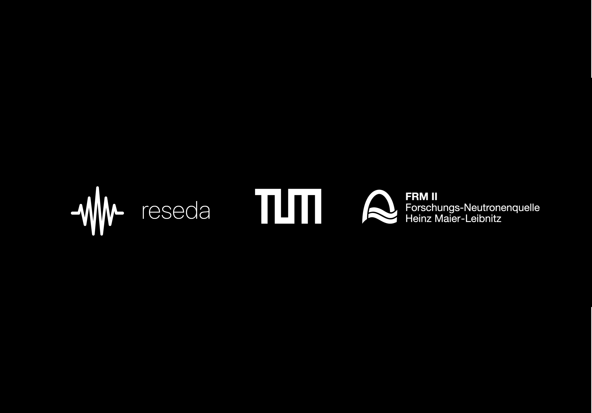

# Reseda Spin

This repository is a collection of jupyter notebooks for visualizing the evolution of neutron spin on the Bloch sphere.

About Reseda: https://mlz-garching.de/reseda

<!--Tips and comments-->
## Tips and comments

1) Some notebooks contain similar functions and the code may be repeated. This is done on purpose so that each notebook can be run completely independently.
2) I would recommend starting with Pauli operators. This is the simplest example of how animation and calculation works.
3) For animations https://qutip.org/docs/latest/guide/guide-bloch.html
   Yes, it's an official guideline. We have to remove all and plot once again for each frame.
4) Note the "folder" function. It must always be run before plotting, otherwise the script will not work!
5) The folder "animations_done" contains examples of done animations of each step by Reseda
6) Mezei II, Radio Frequency Flipper I & II are plotted from from CSV files. A folder with data is also attached.
7) The "App" folder contains the files for the application on the iPad, written in swiftui. The application was written for the MLZ 2023 science fair under a tight deadline. The code may not be very efficient, but it does its job, namely, a presentation visualization of the neutron spin evolution for each step by RESEDA.